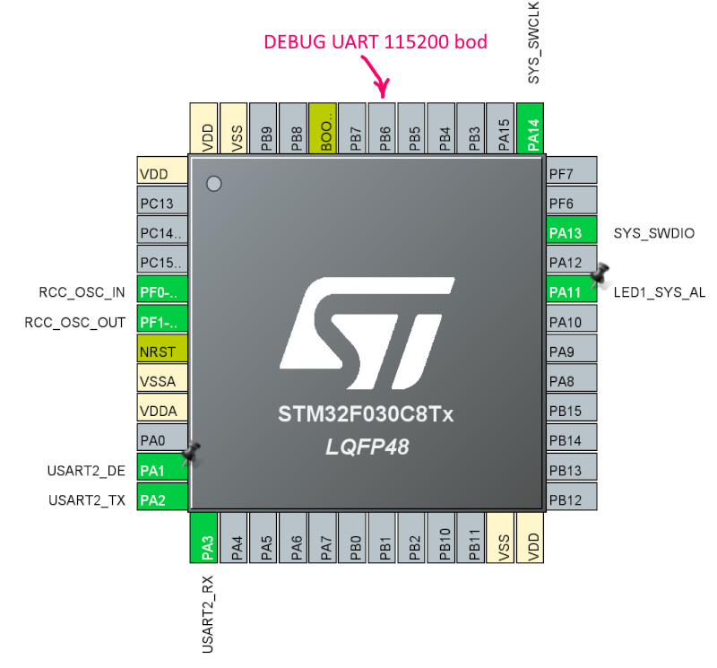

# stm32 nanomodbus poll(blocking) mode

simple example how use stm32 with nanoMODBUS
##  hardware



- STM32F030
- USART2 with DMA
    - PA3 : RX
    - PA2 : TX
    - PA1 : DE pin for RS-485 (Driver Enable flow control)
## Building

```
make
```

https://github.com/kpvnnov

