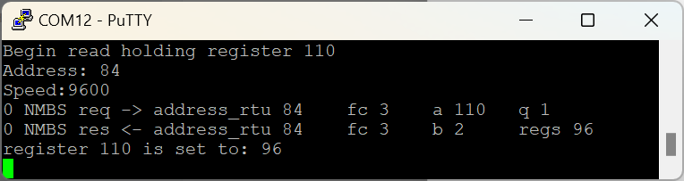

# stm32 nanomodbus poll(blocking) mode

simple example how use stm32 with nanoMODBUS
##  hardware


- STM32F030
- USART2 poll (blocking) mode
    - PA3 : RX
    - PA2 : TX
    - PA1 : DE pin for RS-485 (Driver Enable flow control)
- USART1 debug purpose
    - PB6 :TX

You can connect the console to the output of the pb6 uart (115200 8-N-1) and see the debugging of the program execution



## Building

```
make
```

or use STM32CubeMX

https://github.com/kpvnnov
Peter

